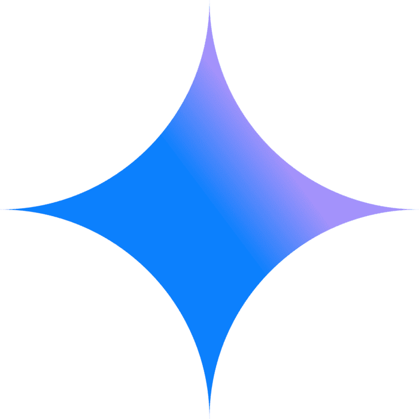
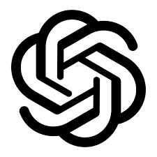

# 🏰 NEOGÊNESE

> Um emocionante jogo de exploração de masmorras (Dungeon Crawler) desenvolvido inteiramente em C para o console.

---

## 👥 Desenvolvedores
* **[José Pedro Martins]** - [https://github.com/JoseMartinss]
* **[Mário Henrique]** - [https://github.com/mariohenr-ec]
* **[Vinicius Carreiro]** - [https://github.com/viniciusccmello-dev]

---

## 📜 História do Jogo

No mundo de Neogênese, um grupo de pessoas que desejavam liberar um demônio antigo com intuito de dominar o mundo e que vem usando  os civis como fonte de energia para os seus rituais em uma torre absorvendo as suas energias vitais enquanto eles estiverem presos durante o período de preparação para a invocação deste demônio no mundo terreno.
Os reinos humanos se aliaram e criaram uma base de controle  para auxiliar você: um aventureiro prestes a enfrentar o seu maior desafio. Com um informante e um ferreiro que vai te fornecer armas, o resto será encontrado a partir de restos mortais de antigos bravos aventureiros que foram derrotados em batalhas anteriores. A base dos cultistas tem 3 niveis com entradas secretas e monstros inimáginaveis espalhados por cada andar, pegue sua arma e salve o mundo dessa ameaça Sobre-Humana!
---

## 🎮 Como Jogar

### Objetivo
O objetivo é explorar a vila, escolher sua arma com o NPC, atravessar três andares da masmorra repleto de perigos, derrotando os monstros de cada andar e no último andar 
derrotar o **Boss Final (Z)** para vencer a aventura.

### Controles
| Tecla | Ação | Símbolo Visual |
| :---: | :--- | :---: |
| **W** | Move para cima | `^` |
| **A** | Move para a esquerda | `<` |
| **S** | Move para baixo | `v` |
| **D** | Move para a direita | `>` |
| **i** | Interage com objetos (NPC, Chaves, Botões) | - |
| **o** | Realiza um ataque (depende da arma) | - |

---

## 🧩 Guia de Símbolos

### O Jogador e Objetos
* `< ^ > v` : O Jogador e a direção para onde está olhando.
* `@` : **Chave** (necessária para abrir portas).
* `D` : **Porta Fechada** (bloqueia o caminho).
* `=` : **Porta Aberta** (caminho livre).
* `L` : **Escada** (avança para o próximo andar).
* `O` : **Botão** (ativa mecanismo de destruição de paredes no mapa).

### Perigos e Obstáculos
* `*` : **Parede** (intransponível).
* `#` : **Espinho** (causa dano fatal e reinicia a fase).
* `k` : **Caixa** (pode ser destruída com ataque).

### Inimigos
* `X` : **Monstro Tipo 1** (movimentação aleatória).
* `Y` : **Monstro Tipo 2** (persegue o jogador).
* `Z` : **Boss Final** (comportamento único e desafiador).

---

## ⚔️ Arsenal (Armas)
Ao iniciar na Vila, você deve escolher uma das três armas com o NPC:
1. **Espada**: Ataque em área de $3 \times 2$ à frente.
2. **Arco e Flecha**: Ataque em linha reta (4 células).
3. **Cajado**: Ataque em área circular ao redor do jogador.

---

## 🤖 Declaração de Uso de IA Generativa

### IAs Utilizadas: Gemini e Chat GPT

  
  

# O uso foi voltado principalmente para:
- Esclarecimento de como a lógica de movimentação do jogador, interação com npc, interações na matriz dos mapas no geral.
- Correção de bugs nos códigos como: caixas sumindo ao passar por cima, portas abrindo sem chaves e entrar no mapa sem armas.
- Aprendizado de como atribuir cores em C nos elementos das matrizes.
- Aprendizado de como desenvolver a lógica de movimentação dos monstros.
# Boas práticas de Desenvolvimento com IAs (STD) utilizadas:
- Arquivos de spec.md foram amplamente utilizados para minimizar os erros das IAs e para definir as especificações da modificação requisidada.

---
*Projeto desenvolvido para a disciplina de Programação - 2026.*
